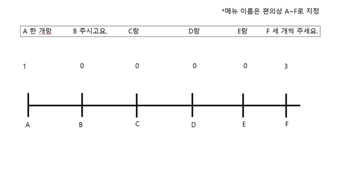
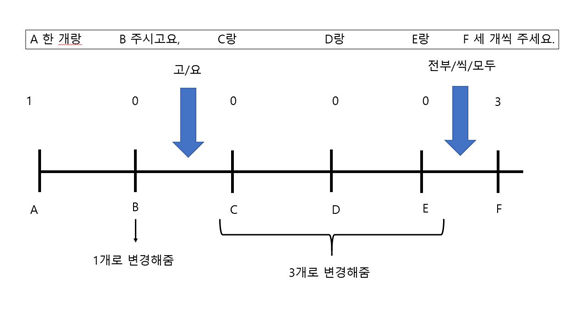
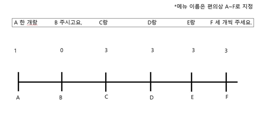

# STT를 통해 출력된 결과의 보정
## 문장을 자모 단위로 분리하기 위하여 hgtk 라이브러리를 사용
## 문장 간의 구성 자모들의 일치성을 비교하기 위해 difflib 라이브러리를 사용

### 1) 네이버의 음성인식 결과와 ETRI의 음성인식 결과를 비교
1-1) 네이버와 ETRI의 음성인식 결과를 자모 단위로 분리하여 r_txt1과 2에 각각 저장한다.
1-2) 해당 가게의 메뉴들도 자모 단위로 분리한 후 r_txt와 비교하여 일정 수준 이상의 일치율 (80% 전후)을 보이는 경우만 all_rate1, 2 변수에 저장
1-3) all_rate1과 2를 비교하여 더 큰 경우의 음성인식 결과를 r_txt 변수에 저장
     ex)all_rate1>all_rate2이면 r_txt1(음소 분리된 네이버의 음성인식 결과)을 저장

### 2) r_txt에 저장된 문장 보정
2-1) r_txt와 자모가 분리된 메뉴들을 비교하여 일정 수준 이상의 일치율을 보이는 경우, 그 구간의 띄어쓰기를 제거한 후 본 메뉴이름으로 r_txt를 보정함
2-2) r_txt의 자모를 합쳐 문장의 형태로 만듬 
2-3) 메뉴이름 앞과 수량 표현의 앞, 뒤에 띄어쓰기가 없는 경우 띄어쓰기를 삽입하여 문장을 보정함

## 메뉴 전체의 수량 확인
1) 주문이 들어갈 메뉴와 주문서에서 그 메뉴의 인덱스 구간을 각각 menu_list와 num_index에 저장
2) 해당 메뉴와 가장 가까운 수량을 찾은 후 menu_list의 해당 메뉴에 append, 수량 표현이 해당 메뉴와 관련된 수량표현이 많은 경우 그 중 가장 큰 수를, 없는 경우에는 0을 
   append

3-1) 수량 표현이 없는 메뉴가 있는 경우는 <통틀어서 수량 표현을 한 경우>와 
     <한 개씩이라서 언급을 안 한 경우> 두 가지
3-2) 통틀어서 수량 표현을 한 경우에는 우선 만들어놓은 접속사 리스트와 부사 리스트를 
     이용해 해당 표현이 있는지를 확인한다. 만약 해당 표현이 있다면 그 사이 구간에 있는
     메뉴들을 revise_list에 저장한다. 

그리고 전체 menu_list에서 revise_list가 끝난 바로 다음 수량을 revise_list에 해당하는 메뉴들에 적용하여 준다.

4) 이후에 남아있는 수량이 0인 메뉴들은 한 개씩이라서 언급을 안 한 경우이므로 전부 1로 바꿔줌. 

## 옵션 메뉴 추가
1) 메뉴 이름과 해당 위치들을 뽑아서 list에 저장
2) 저장된 메뉴들을 문장 내의 위치 순서대로 정렬
3) 단어를 엮는 조사(ex: 랑)를 기준으로 메뉴를 합쳐 텍스트 내에서 구간을 확정지음
4) 위의 구간에서 포함하고 있는 메뉴 이름과 문장 내의 그 구간의 위치를 list에 저장
5) 위의 list를 기준으로 한 구간 사이에 옵션이 있는지 없는지를 확인하고, 있다면 
   final 배열에 메뉴 이름과 옵션 메뉴 이름과 수량을 추가함
6) 한 메뉴에 option 메뉴가 1개보다 많을 경우를 위하여 추가된 옵션 메뉴를 list화 시킴
7) json file을 만들기 위해서 list 수정
8) json 형식으로 dictionary 만듬

## 토핑 메뉴 추가 및 dictionary 수정
1) 위에서 사용한 list를 바탕으로 그 구간 사이에 토핑이 있는지 없는지를 확인하고, 있다면 
   final 배열에 메뉴 이름과 토핑 메뉴 이름과 수량을 추가함
2) 위에서 만들어진 dictionary와 비교하여 새로운 메뉴로 추가되어야 할지, 아니면 기존 
   메뉴에 토핑만 추가되면 될지를 확인하고 그에 맞추어 dictionary 수정
3) 옵션도 없고 토핑도 없어서 dictionary에 추가되지 못한 메뉴들을 메뉴와 수량만 해서
   dictionary에 추가
